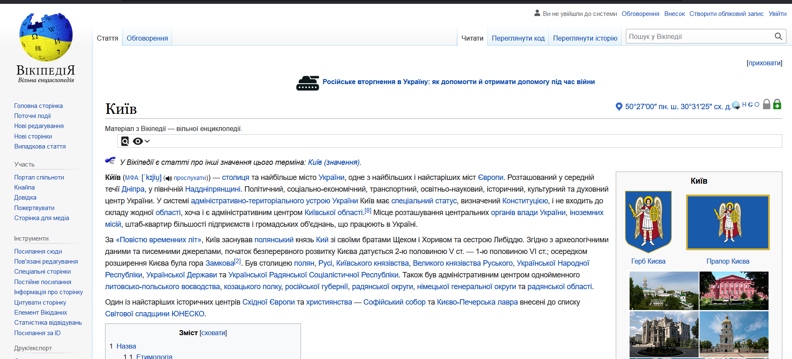

# Links, anchor links. Images in html
---
## Task - map
### Clicking on a specific region of the map opens a wikipedia page about that region

 
 

## Task - university
### Small page about my university with using anchor links

 
 

